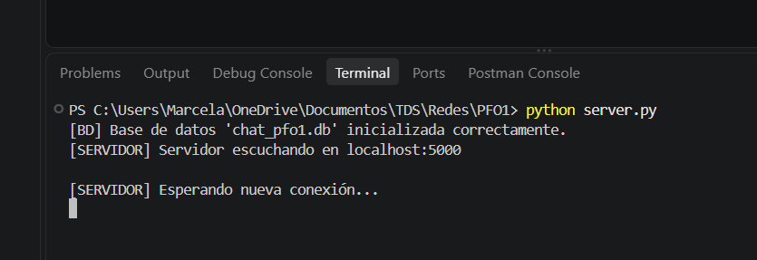
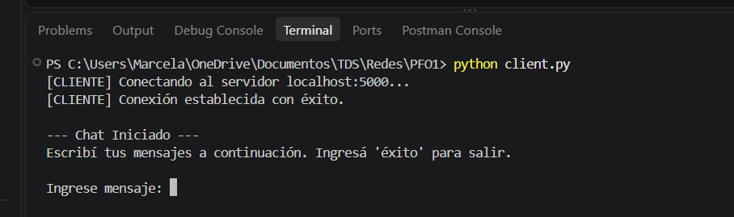
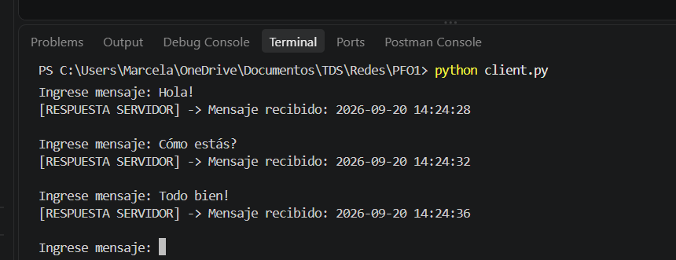
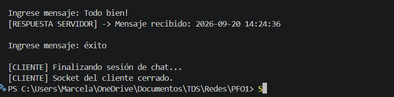
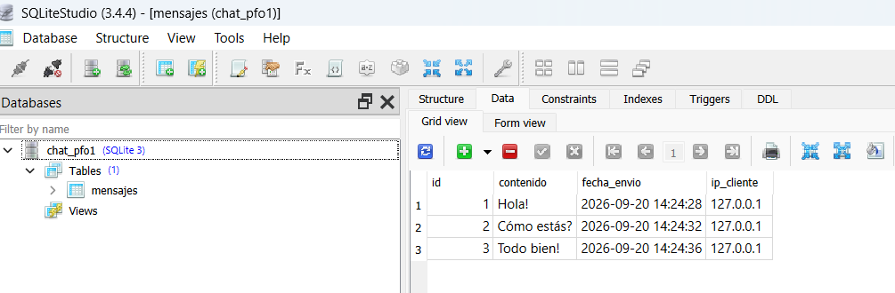

# 💻 PFO 1 — Programación sobre Redes

## Chat Cliente-Servidor con Sockets TCP/IP y SQLite

Repositorio correspondiente a la **Práctica Formativa Obligatoria 1 (PFO1)** de la materia **Programación sobre Redes**.

El proyecto implementa un sistema de comunicación **cliente-servidor** utilizando **sockets TCP/IP en Python**, con una arquitectura modular, manejo de errores y persistencia de los mensajes recibidos mediante **SQLite**.

---

## 👩‍💻 Alumna

* **Nombre:** Marcela Cordini
* **Carrera:** Tecnicatura en Desarrollo de Software
* **Institución:** IFTS 29

---

## 🎯 Objetivo del trabajo

El objetivo de esta práctica es implementar un sistema básico de comunicación **cliente-servidor** utilizando sockets TCP/IP, permitiendo recibir mensajes de un cliente, almacenarlos en una base de datos SQLite y enviar una confirmación al cliente.

Requerimientos:

* Configuración de un servidor TCP en `localhost:5000`.
* Modularización mediante funciones independientes.
* Aceptación de conexiones de clientes.
* Recepción de múltiples mensajes durante una misma sesión.
* Persistencia de los mensajes recibidos en SQLite.
* Registro de:

  * contenido del mensaje;
  * fecha y hora de recepción;
  * dirección IP del cliente.
* Respuesta al cliente mediante el formato:

```text
Mensaje recibido: <timestamp>
```

* Manejo de errores relacionados con sockets y base de datos.
* Finalización de la sesión mediante la palabra clave `éxito`.

---

## 🛠️ Tecnologías utilizadas

| Tecnología       | Uso                                |
| ---------------- | ---------------------------------- |
| **Python 3.x**   | Lenguaje de programación           |
| **socket**       | Comunicación mediante TCP/IP       |
| **sqlite3**      | Persistencia de datos              |
| **datetime**     | Generación de fecha y hora         |
| **Git / GitHub** | Control de versiones y repositorio |


---

## 📁 Estructura del repositorio

```text
redes_PFO1/
│
├── img/
│   ├── base-datos.png
│   ├── cliente-funcionado.png
│   ├── mensaje-respuesta.png
│   ├── salida.png
│   └── servidor-funcionando.png
│
├── .gitignore
├── client.py
├── server.py
└── README.md
```

> **Nota:** El archivo `chat_pfo1.db` se genera automáticamente al iniciar el servidor.

---

# 🏗️ Arquitectura del sistema

La aplicación está dividida en dos componentes principales:

```text
┌─────────────────┐
│     CLIENTE     │
│    client.py    │
└────────┬────────┘
         │
         │ TCP/IP
         │ localhost:5000
         ▼
┌─────────────────┐
│    SERVIDOR     │
│    server.py    │
└────────┬────────┘
         │
         │ SQLite
         ▼
┌─────────────────┐
│  chat_pfo1.db   │
│    mensajes     │
└─────────────────┘
```

---

## 🖥️ Servidor — `server.py`

El servidor es responsable de:

* Inicializar la base de datos.
* Crear la tabla `mensajes` si no existe.
* Crear y configurar el socket TCP.
* Escuchar conexiones en `localhost:5000`.
* Aceptar conexiones de clientes.
* Obtener la dirección IP del cliente.
* Recibir los mensajes enviados.
* Registrar los mensajes en SQLite.
* Generar un timestamp.
* Enviar una respuesta de confirmación.
* Controlar errores relacionados con sockets y SQLite.
* Finalizar la conexión cuando el cliente envía `éxito`.

### Funciones principales

#### `init_db()`

Inicializa la base de datos SQLite y crea la tabla `mensajes` si todavía no existe.

#### `guardar_mensaje()`

Guarda cada mensaje recibido junto con:

* contenido;
* fecha y hora;
* dirección IP del cliente.

#### `init_socket()`

Configura el socket TCP del servidor.

Utiliza:

```python
socket.AF_INET
```

para trabajar con IPv4 y:

```python
socket.SOCK_STREAM
```

para utilizar el protocolo TCP.

El servidor queda asociado a:

```text
localhost:5000
```

#### `atender_clientes()`

Acepta conexiones, recibe mensajes, guarda la información en SQLite y envía la respuesta correspondiente al cliente.

---

## 💬 Cliente — `client.py`

El cliente es responsable de:

* Conectarse al servidor mediante TCP.
* Permitir el ingreso de mensajes por teclado.
* Enviar múltiples mensajes durante una misma conexión.
* Recibir y mostrar la respuesta del servidor.
* Finalizar la sesión cuando el usuario ingresa `éxito`.
* Manejar errores de conexión.

La conexión se realiza por defecto a:

```text
localhost:5000
```

---

# ⚙️ Configuración predeterminada

```text
HOST: localhost
PUERTO: 5000
PROTOCOLO: TCP
```

El servidor utiliza IPv4 mediante `AF_INET` y TCP mediante `SOCK_STREAM`.

---

# 🗄️ Persistencia de datos

Los mensajes recibidos se almacenan automáticamente en:

```text
chat_pfo1.db
```

La base de datos contiene una tabla llamada:

```text
mensajes
```

## 📋 Esquema de la tabla

| Columna       | Tipo                                | Descripción                               |
| ------------- | ----------------------------------- | ----------------------------------------- |
| `id`          | `INTEGER PRIMARY KEY AUTOINCREMENT` | Identificador único del mensaje           |
| `contenido`   | `TEXT NOT NULL`                     | Mensaje enviado por el cliente            |
| `fecha_envio` | `TEXT NOT NULL`                     | Fecha y hora en que se recibió el mensaje |
| `ip_cliente`  | `TEXT NOT NULL`                     | Dirección IP del cliente                  |

Los datos se almacenan mediante una consulta parametrizada:

```python
cursor.execute("""
    INSERT INTO mensajes (contenido, fecha_envio, ip_cliente)
    VALUES (?, ?, ?)
""", (contenido, fecha_envio, ip_cliente))
```

---

# 🛡️ Manejo de errores

El proyecto incorpora manejo de excepciones para evitar interrupciones inesperadas durante la ejecución.

## 🔌 Errores de conexión

El cliente contempla:

### `ConnectionRefusedError`

Se utiliza cuando el cliente intenta conectarse mientras el servidor no está ejecutándose.

El programa informa al usuario que debe iniciar `server.py`.

### `OSError`

Permite controlar problemas generales relacionados con la comunicación mediante sockets.

---

## 🔧 Errores del servidor

El servidor utiliza `OSError` para detectar problemas relacionados con la creación, configuración o utilización del socket.

Por ejemplo, puede producirse un error si el puerto `5000` no está disponible.

---

## 🗄️ Errores de SQLite

Las operaciones relacionadas con la base de datos utilizan:

```python
except sqlite3.Error
```

Esto permite controlar errores relacionados con:

* creación de la base de datos;
* creación de tablas;
* inserción de mensajes;
* acceso a SQLite.

Si la base de datos no puede inicializarse correctamente, el servidor no comienza a aceptar conexiones.

---

## 🔤 Errores de codificación

El servidor también contempla `UnicodeDecodeError` para controlar mensajes que no puedan ser interpretados correctamente como UTF-8.

---

# 🧪 Guía rápida de prueba

Para realizar una prueba local:

### Paso 1

Iniciar el servidor:

```bash
python server.py
```

### Paso 2

Abrir otra terminal.

### Paso 3

Iniciar el cliente:

```bash
python client.py
```

### Paso 4

Enviar uno o varios mensajes:

```text
Ingrese mensaje: Hola
Ingrese mensaje: ¿Cómo estás?
Ingrese mensaje: Todo bien!
```

### Paso 5

Verificar que el cliente reciba una respuesta para cada mensaje:

```text
[RESPUESTA SERVIDOR] -> Mensaje recibido: <timestamp>
```

### Paso 6

Finalizar la sesión:

```text
Ingrese mensaje: éxito
```

### Paso 7

Comprobar que los mensajes hayan sido almacenados en:

```text
chat_pfo1.db
```

---

# 🖼️ Evidencias de funcionamiento

## 🖥️ Servidor funcionando



---

## 💬 Cliente funcionando



---

## 📨 Mensajes - Respuestas



---

## 📤 Salida



---

## 🗄️ Registros almacenados en SQLite



---

# 📌 Resultado

El proyecto implementa un **chat básico cliente-servidor mediante sockets TCP/IP**, permitiendo establecer una conexión entre cliente y servidor, intercambiar múltiples mensajes durante una misma sesión y almacenar cada mensaje recibido en una base de datos SQLite.

Cada registro incluye el **contenido del mensaje, fecha y hora de recepción e IP del cliente**, mientras que el servidor devuelve una confirmación con el timestamp correspondiente.

El sistema también incorpora **modularización, comentarios explicativos y manejo de errores**, de acuerdo con los requerimientos establecidos para la PFO1.

---

## 📚 PFO 1 — Programación sobre Redes

**Tecnicatura en Desarrollo de Software — IFTS 29**

**Marcela Cordini**
